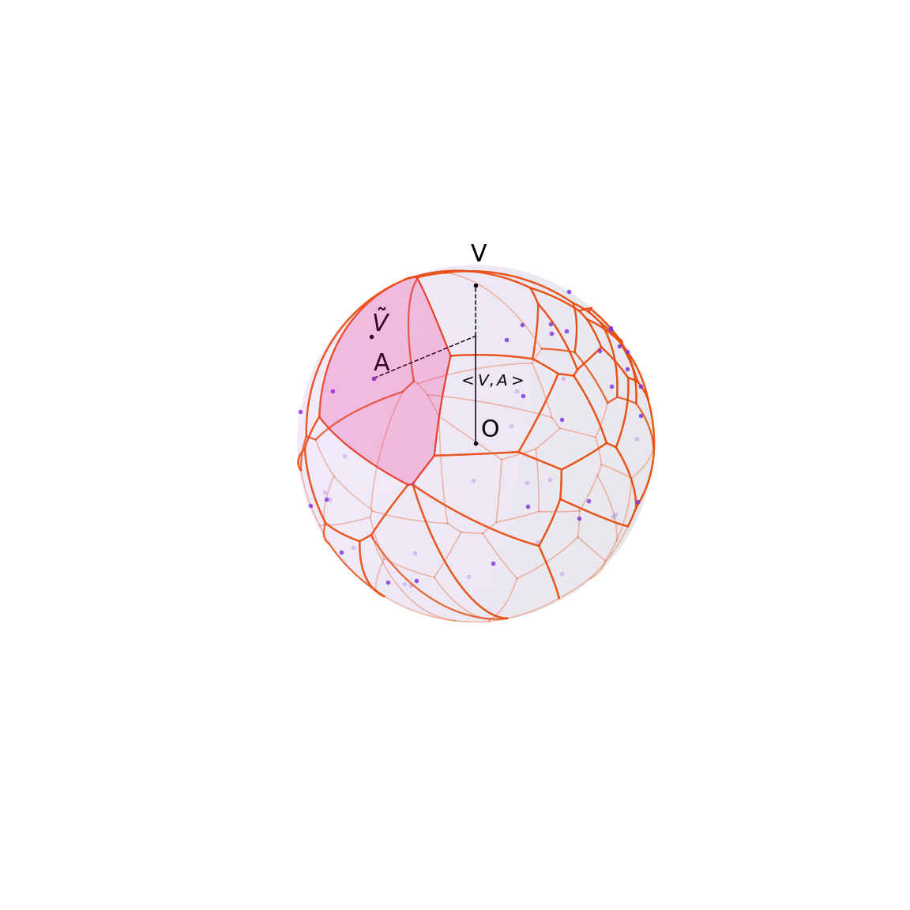
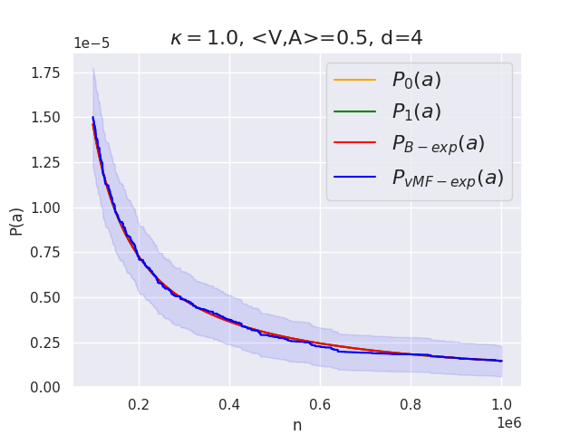
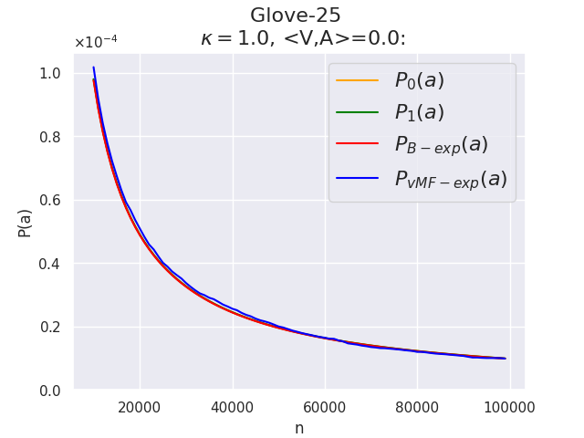
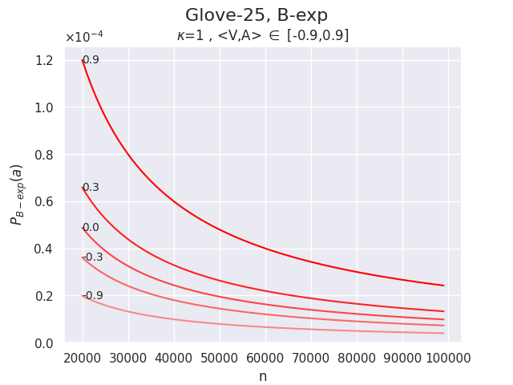
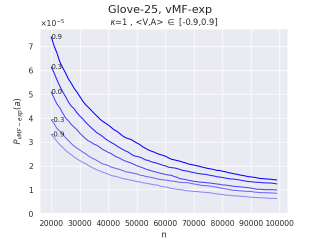
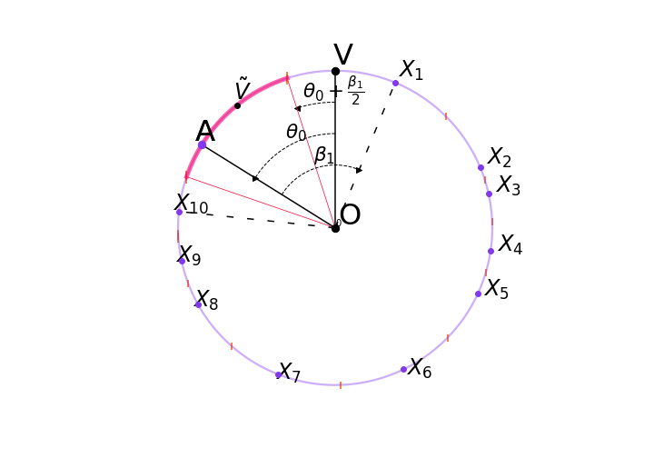

# von Mises-Fisher Exploration
Repository for the Paper "Exploring Large Action Sets with Hyperspherical
Embeddings using von Mises-Fisher Sampling" by Anonymous Authors.



This paper introduces von Mises-Fisher exploration (vMF-exp), a scalable method for exploring large action sets in reinforcement learning problems where hyperspherical embedding vectors represent these actions. vMF-exp involves initially sampling a state embedding representation using a von Mises-Fisher distribution, then exploring this representation's nearest neighbors, which scales to virtually unlimited numbers of candidate actions.
We show that, under theoretical assumptions, vMF-exp asymptotically maintains the same probability of exploring each action as Boltzmann Exploration (B-exp), a popular alternative that, nonetheless, suffers from scalability issues as it requires computing softmax values for each action.
Consequently, vMF-exp serves as a scalable alternative to B-exp for exploring large action sets with hyperspherical embeddings. 
Experiments on simulated data, real-world public data, and the successful large-scale deployment of vMF-exp on the recommender system of a global music streaming service empirically validate the key properties of the proposed method.


# Experiments
Requirements: implicit==0.6.1, matplotlib==3.6.2, pandas==1.5.2, psutil==5.9.4, pympler==1.0.1, scipy==1.7.3, seaborn==0.12.1, tables==3.7.0, tqdm==4.64.1.
## Spherical Uniform Distribution
The script `src/uniform/compute_probas.py` will run Monte Carlo simulations estimating the probability for von Mises-Fisher exploration and Boltzmann exploration to sample an action with know similarity given a state vector. The result can then be plotted using `src/uniform/plot_probas.py` where it will be compared against the theoretical expressions of **Proposition 4.2** and **Proposition 4.4**.
For instance, to reproduce **Figure 2.a**, one can run the following command
```
python -m src.uniform.compute_probas  -k 1.0 -a 0.5 -d 4 -N 1000000 -bs 256 -nt 30000
```
which will run the corresponding Monte Carlo Simulations (~ 3 hours on an Nvidia GTX 1080), followed by the command
```
python -m src.uniform.plot_probas -path simulations/k=1.0_a=0.50_d=4_N=1000000_samples=7680000/
```
which will create a plot similar to the following one



and save in a sub-folder of /simulations/ named according to the chosen parameters.

## Glove-25 Embeddings

### Download data

Data can be found at https://nlp.stanford.edu/projects/glove/
Experiences were run using the 25 dimensions embeddings provided.
After the correct file is downloaded, Unzip it and place it into the empty folder "dataset" already created.

### Compute probabilities for a given set of parameters
The script `src/glove-25/compute_probas.py` will run Monte Carlo simulations estimating the probability for von Mises-Fisher exploration and Boltzmann exploration to sample an action with known similarity given a state vector. All vectors are sampled from the Glove 25 dataset previously downloaded (see above). The result can then be plotted using `src/glove-25/plot_probas.py`.

For instance, to reproduce **Figure 2.a**, one can run the following command
```
python -m src.glove-25.compute_probas -k 1 -a 0.0 -n glove-25 -bs 3000 -nt 10000
```
which will run the corresponding Monte Carlo Simulations, followed by the command
```
python -m src.glove-25.plot_probas --path results/glove-25/k\=1.0_a\=0.00_samples\=30000000/
```
which will create a plot similar to the following one



and save the probabilities in a sub-folder of /results/ named according to the chosen parameters.

### Compare Boltmann and von-Mises Fisher Explorations for a range of values
The script `src/glove-25/compare_boltzmann_vs_vmf.py` will reproduce **Figure 1.a** and **Figure 1.b** for a specified range of values of <V,A> that must first be computed using `src/glove-25/compute_probas.py` with changing values of a (see above).

For instance, running `src/glove-25/compute_probas.py`  several times with values of a in [0.9,0.3,0.0,-0.3,-0.9] and then running
```
python -m src.glove-25.compare_boltzmann_vs_vmf --values 0.9,0.3,0.0,-0.3,-0.9
```
will create the following two plots





# Optionnal : Visual Representations
## 3D and 2D Voronoï tessellations
The script `src/uniform/plot_voronoi_3D.py` will reproduce **Figure 1.b**, which is an exemple of the Voronoi tesselation of 51 vectors uniformly distributed on the 3D sphere.
Running the command
```
python -m src.uniform.plot_D_voronoi --shuffle
```
will sample new vectors and result in a plot similar to the following


## Normal Approximation

The script `plot_voronoi_2D.py` will reproduce the plot of **Figure 1.c**, which is an exemple of the Voronoi tesselation of 11 vectors uniformly distributed on the 2D circle.
Running the command
```
python -m src.uniform.plot_3D_voronoi --shuffle
```
will sample new vectors and result in a plot similar to the following


